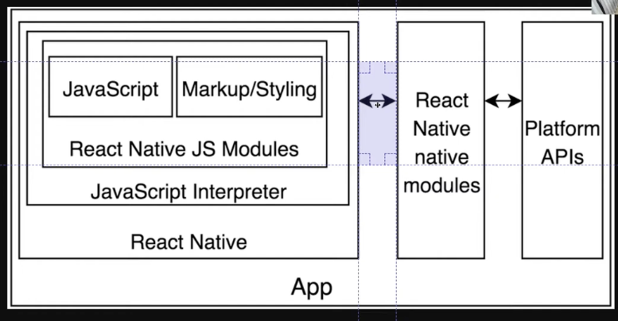
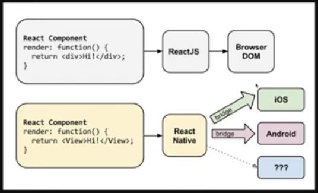
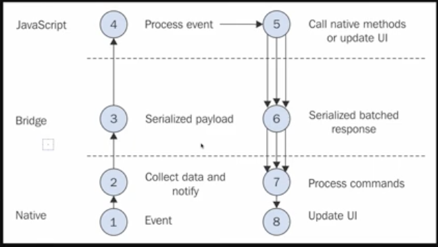

# React Native
- https://nomadcoders.co/react-native-for-beginners/

## 강의 소개


React Native를 사용하기 위해서는 Javascript 코드만으로는 안됨. Java, Xcode 등을 설치해주고 bridge들을 통해 코드가 운영체제와 통신할 수 있도록 하는 인프라가 가장 중요하다. 


- 리액트 네이티브 앱을 compile 하면 apk / ipa 확장자로 결과물 나옴.

- 이 강좌에서는 xcode 등은 우선 설치하지 않음. Google Play Store에 이미 이런 시설이 준비된  앱이 있어서 인프라가 준비되어있는데 코드 부분만 없음 (그림 내에서 Javascript, Markup/Styling 파트). 그걸 사용할 것.
    * https://expo.dev/

### 환경 설정

Expo Cli 설치
```bash
$ npm install --blobal expo-cli
$ brew update; brew install watchman
```

- 맥인 경우 watchman도 설치해줘야함.
- 그리고 안드로이드/아이폰 앱스토어에서 Expo 앱 다운로드.

-> Expo는 우리의 React Native 코드를 폰으로 전송시켜줌. Expo는 React Native 코드를 실행시켜서 바로 볼 수 있음.



- React Native가 bridge를 통해 ios, android로 번역해줌.


